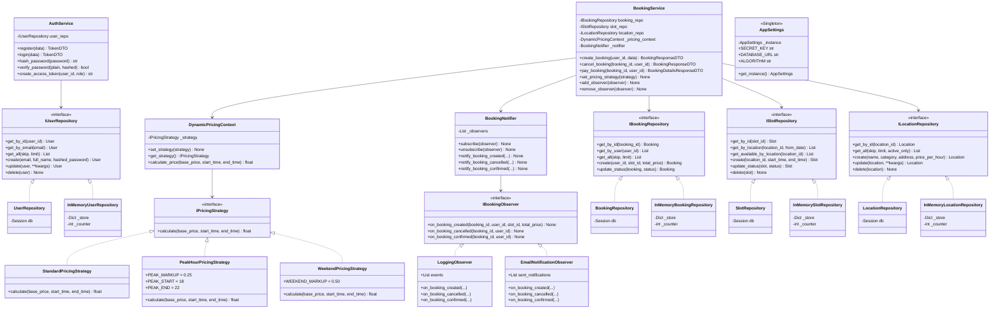

# Class Diagram — SportBook UA

```mermaid
classDiagram
    %% ── Repository Interfaces ──────────────────────────────────────────
    class IUserRepository {
        <<interface>>
        +get_by_id(user_id) User
        +get_by_email(email) User
        +get_all(skip, limit) List
        +create(email, full_name, hashed_password) User
        +update(user, **kwargs) User
        +delete(user) None
    }

    class ILocationRepository {
        <<interface>>
        +get_by_id(location_id) Location
        +get_all(skip, limit, active_only) List
        +create(name, category, address, price_per_hour) Location
        +update(location, **kwargs) Location
        +delete(location) None
    }

    class ISlotRepository {
        <<interface>>
        +get_by_id(slot_id) Slot
        +get_by_location(location_id, from_date) List
        +get_available_by_location(location_id) List
        +create(location_id, start_time, end_time) Slot
        +update_status(slot, status) Slot
        +delete(slot) None
    }

    class IBookingRepository {
        <<interface>>
        +get_by_id(booking_id) Booking
        +get_by_user(user_id) List
        +get_all(skip, limit) List
        +create(user_id, slot_id, total_price) Booking
        +update_status(booking, status) Booking
    }

    %% ── SQL Implementations ────────────────────────────────────────────
    class UserRepository {
        -Session db
    }
    class LocationRepository {
        -Session db
    }
    class SlotRepository {
        -Session db
    }
    class BookingRepository {
        -Session db
    }

    %% ── In-Memory Implementations ──────────────────────────────────────
    class InMemoryUserRepository {
        -Dict _store
        -int _counter
    }
    class InMemoryLocationRepository {
        -Dict _store
        -int _counter
    }
    class InMemorySlotRepository {
        -Dict _store
        -int _counter
    }
    class InMemoryBookingRepository {
        -Dict _store
        -int _counter
    }

    IUserRepository <|.. UserRepository
    IUserRepository <|.. InMemoryUserRepository
    ILocationRepository <|.. LocationRepository
    ILocationRepository <|.. InMemoryLocationRepository
    ISlotRepository <|.. SlotRepository
    ISlotRepository <|.. InMemorySlotRepository
    IBookingRepository <|.. BookingRepository
    IBookingRepository <|.. InMemoryBookingRepository

    %% ── Strategy Pattern ────────────────────────────────────────────────
    class IPricingStrategy {
        <<interface>>
        +calculate(base_price, start_time, end_time) float
    }

    class StandardPricingStrategy {
        +calculate(base_price, start_time, end_time) float
    }

    class PeakHourPricingStrategy {
        +PEAK_MARKUP = 0.25
        +PEAK_START = 18
        +PEAK_END = 22
        +calculate(base_price, start_time, end_time) float
    }

    class WeekendPricingStrategy {
        +WEEKEND_MARKUP = 0.50
        +calculate(base_price, start_time, end_time) float
    }

    class DynamicPricingContext {
        -IPricingStrategy _strategy
        +set_strategy(strategy) None
        +get_strategy() IPricingStrategy
        +calculate_price(base_price, start_time, end_time) float
    }

    IPricingStrategy <|.. StandardPricingStrategy
    IPricingStrategy <|.. PeakHourPricingStrategy
    IPricingStrategy <|.. WeekendPricingStrategy
    DynamicPricingContext --> IPricingStrategy

    %% ── Observer Pattern ────────────────────────────────────────────────
    class IBookingObserver {
        <<interface>>
        +on_booking_created(booking_id, user_id, slot_id, total_price) None
        +on_booking_cancelled(booking_id, user_id) None
        +on_booking_confirmed(booking_id, user_id) None
    }

    class LoggingObserver {
        +List events
        +on_booking_created(...)
        +on_booking_cancelled(...)
        +on_booking_confirmed(...)
    }

    class EmailNotificationObserver {
        +List sent_notifications
        +on_booking_created(...)
        +on_booking_cancelled(...)
        +on_booking_confirmed(...)
    }

    class BookingNotifier {
        -List _observers
        +subscribe(observer) None
        +unsubscribe(observer) None
        +notify_booking_created(...) None
        +notify_booking_cancelled(...) None
        +notify_booking_confirmed(...) None
    }

    IBookingObserver <|.. LoggingObserver
    IBookingObserver <|.. EmailNotificationObserver
    BookingNotifier --> IBookingObserver

    %% ── Services ────────────────────────────────────────────────────────
    class BookingService {
        -IBookingRepository booking_repo
        -ISlotRepository slot_repo
        -ILocationRepository location_repo
        -DynamicPricingContext _pricing_context
        -BookingNotifier _notifier
        +create_booking(user_id, data) BookingResponseDTO
        +cancel_booking(booking_id, user_id) BookingResponseDTO
        +pay_booking(booking_id, user_id) BookingDetailsResponseDTO
        +set_pricing_strategy(strategy) None
        +add_observer(observer) None
        +remove_observer(observer) None
    }

    class AuthService {
        -IUserRepository user_repo
        +register(data) TokenDTO
        +login(data) TokenDTO
        +hash_password(password) str
        +verify_password(plain, hashed) bool
        +create_access_token(user_id, role) str
    }

    class AppSettings {
        <<Singleton>>
        -AppSettings _instance
        +get_instance() AppSettings
        +SECRET_KEY str
        +DATABASE_URL str
        +ALGORITHM str
    }

    BookingService --> DynamicPricingContext
    BookingService --> BookingNotifier
    BookingService --> IBookingRepository
    BookingService --> ISlotRepository
    BookingService --> ILocationRepository
    AuthService --> IUserRepository
```
