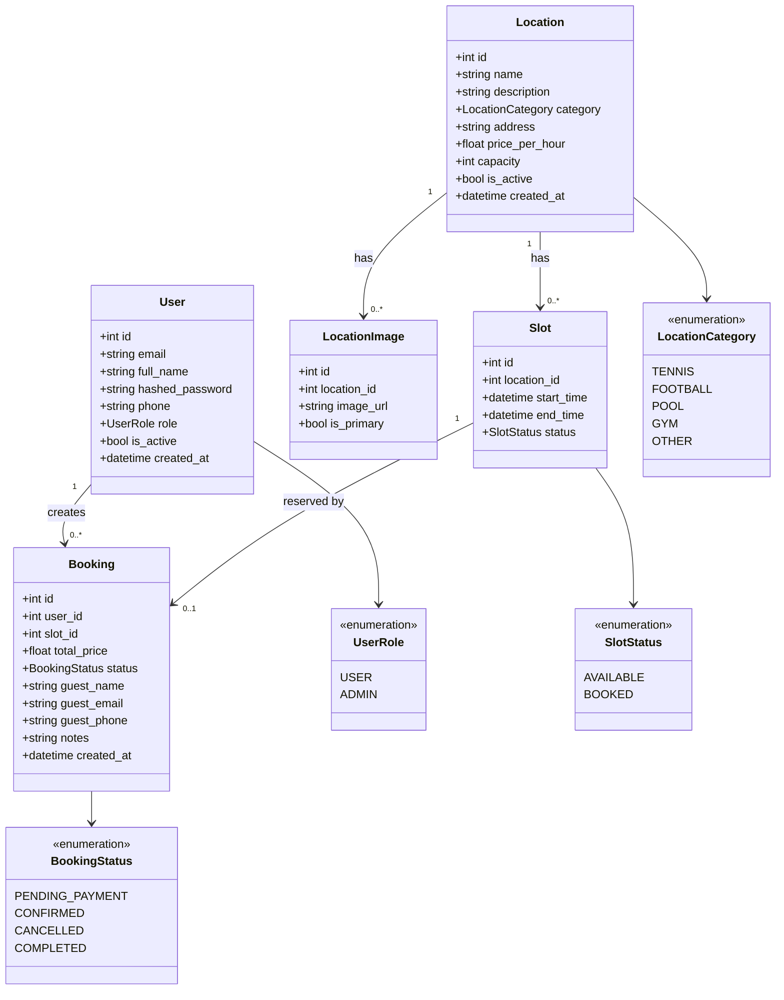

# Domain Model — SportBook UA

## Business Rules

1. A `Slot` can only have **one active** `Booking` at a time (1:0..1).
2. A `Slot` transitions: `AVAILABLE` → `BOOKED` on booking creation; `BOOKED` → `AVAILABLE` on cancellation.
3. A `Booking` starts as `PENDING_PAYMENT`; moves to `CONFIRMED` after payment; `CANCELLED` by user/admin.
4. An inactive `User` (`is_active = False`) cannot log in.
5. `total_price` is calculated via the active **PricingStrategy** at booking creation time.
6. Pricing strategies: Standard (base × hours), PeakHour (+25% for 18–22h), Weekend (+50% Sat/Sun).
