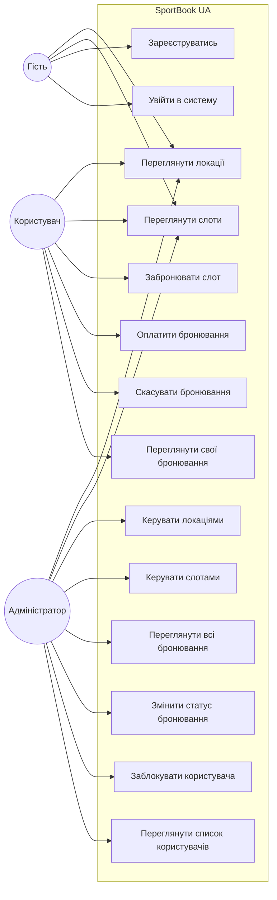

# Use Case Diagram — SportBook UA

## Actors

| Актор | Опис |
|-------|------|
| **Гість** | Незареєстрований відвідувач. Може переглядати локації та слоти. |
| **Користувач** | Зареєстрований та авторизований користувач. Може бронювати, оплачувати та скасовувати бронювання. |
| **Адміністратор** | Має повний доступ до управління системою. |

## Ключові сценарії

| # | Use Case | Актор | Передумова | Основний потік |
|---|----------|-------|-----------|----------------|
| 1 | Забронювати слот | Користувач | Авторизований, слот AVAILABLE | Вибір слоту → POST /bookings/ → статус PENDING_PAYMENT |
| 2 | Оплатити бронювання | Користувач | Бронювання в статусі PENDING_PAYMENT | POST /bookings/{id}/pay → статус CONFIRMED |
| 3 | Скасувати бронювання | Користувач / Адмін | Бронювання не скасоване | POST /bookings/{id}/cancel → статус CANCELLED, слот → AVAILABLE |
| 4 | Заблокувати користувача | Адміністратор | Користувач існує | PUT /users/{id}/deactivate → is_active = False |
| 5 | Додати локацію | Адміністратор | — | POST /locations/ → нова локація з категорією та ціною |
| 6 | Видалити слот | Адміністратор | Слот не BOOKED | DELETE /slots/{id} |
| 7 | Переглянути всі бронювання | Адміністратор | Авторизований як ADMIN | GET /bookings/ → список з деталями користувача та локації |
